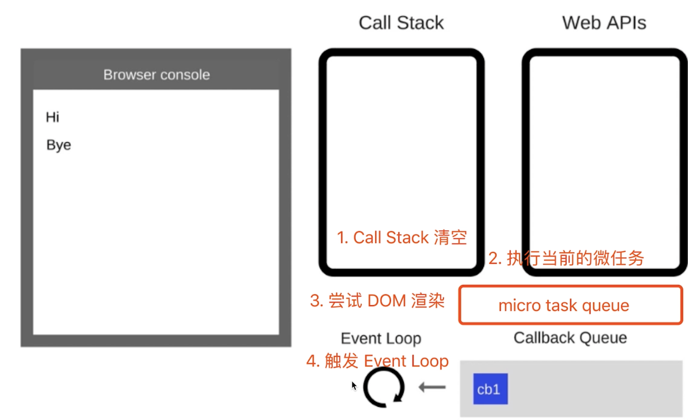

# 微任务和宏任务

事件循环的工作流程：

- 首先执行同步代码，直到执行栈为空。
- 然后，JavaScript引擎会查看微任务队列，并执行其中的所有任务，直到微任务队列为空。
- 接着，引擎会取出一个宏任务来执行，然后再次查看并执行微任务队列中的所有任务，如此循环往复。

**在同一个事件循环迭代中，微任务总是会在宏任务之前执行。这意味着，如果一个宏任务在执行过程中产生了新的微任务，那么这些微任务会在当前的宏任务结束、但下一个宏任务开始之前被执行。**

- 微任务有 async / await ，promise。
- 宏任务有 AJAX, setTimeout, setInterval, DOM 事件等。
- 微任务先执行，宏任务后执行。

**宏任务是在 DOM 渲染后触发。微任务是在 DOM 渲染前触发。**

- `Promise` 构造函数的执行器函数是同步执行的。
- `Promise` 的 `then`、`catch` 和 `finally` 方法中的回调函数是异步执行的，并且它们是微任务。

## 连环问：为什么宏任务是在 DOM 渲染后触发。微任务是在 DOM 渲染前触发？

微任务全是 ES6 语法规定的。宏任务是浏览器规定的。

微任务（以 promise 为例），存放在 microTask queue 中等待执行。不会先放入 WebAPIs 等待时机再放入 callback queue。

