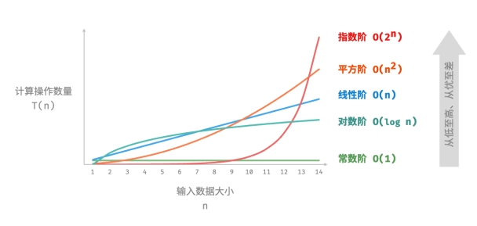
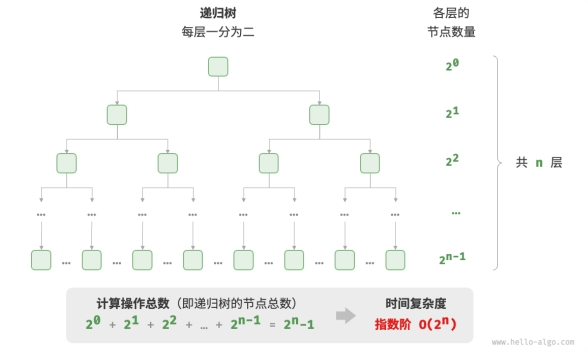
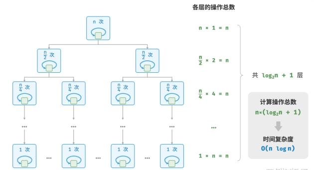
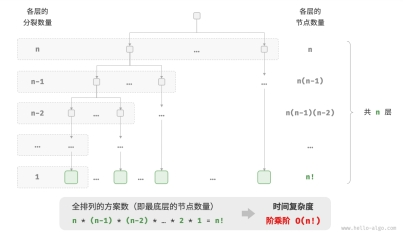

# 时间复杂度

时间复杂度分析统计的不是算法运行时间，**而是算法运行时间随着数据量变大时的增长趋势。** 时间复杂度包括：

𝑂(1) < 𝑂(log 𝑛) < 𝑂(𝑛) < 𝑂(𝑛 log 𝑛) < 𝑂(𝑛^2) < 𝑂(2^𝑛) < 𝑂(𝑛!)

常数阶 < 对数阶 < 线性阶 < 线性对数阶 < 平方阶 < 指数阶 < 阶乘阶



- 常见的定义变量，加减乘除计算，是 O(1)。
- 常见的 for 循环是 O(n)。
- 常见的嵌套 for 循环是 O(n^2)。外层每一次变量改变，内层循环都要走一次。
- 有序数组里面如果用传统的方法（排除转换为 Set 集合使用 has 方法，以及数组的 includes 方法）去寻找某一个数，可以先找到数组中间位置的数，确定在中间位置左边还是右边，这样一次操作下来就少了一半的元素。依次寻找，每一次操作都会少一半的元素。成为二分法，时间复杂度是 O(logn)。
- 在上面 O(logn) 基础上使用 for 循环，就是 O(n*logn) 。

## 1. 常数阶 𝑂(1)

常数阶的操作数量与输入数据大小 𝑛 无关，即不随着 𝑛 的变化而变化。

```javascript
// 常数阶
function constant(n) {
  let count = 0;
  const size = 100000;
  for (let i = 0; i < size; i++) count++;
  return count;
}
```

## 2. 线性阶 𝑂(𝑛)

线性阶的操作数量相对于输入数据大小 𝑛 以线性级别增长。线性阶通常出现在单层循环中：

```javascript
/* 线性阶 */
function linear(n) {
  let count = 0;
  for (let i = 0; i < n; i++) count++;
  return count;
}
```

## 3. 平方阶 𝑂(𝑛^2)

平方阶的操作数量相对于输入数据大小 𝑛 以平方级别增长。平方阶通常出现在嵌套循环中，外层循环和内层循环都为 𝑂(𝑛) ，因此总体为 𝑂(𝑛^2) ：

```javascript
/* 平方阶 */
function quadratic(n) {
  let count = 0;
  // 循环次数与数组长度成平方关系
  for (let i = 0; i < n; i++) {
    for (let j = 0; j < n; j++) {
      count++;
    }
  }
  return count;
}
```

## 4.  指数阶 𝑂(2^n)

生物学的“细胞分裂”是指数阶增长的典型例子：初始状态为 1 个细胞，分裂一轮后变为 2 个，分裂两轮后变为 4 个，以此类推，分裂 𝑛 轮后有 2^𝑛 个细胞。

```javascript
/* 指数阶（循环实现） */
function exponential(n) {
  let count = 0,
  base = 1;
  // 细胞每轮一分为二，形成数列 1, 2, 4, 8, ..., 2^(n-1)
  for (let i = 0; i < n; i++) {
    for (let j = 0; j < base; j++) {
      count++;
    }
    base *= 2;
  }
  // count = 1 + 2 + 4 + 8 + .. + 2^(n-1) = 2^n - 1
  return count;
}
```



在实际算法中，指数阶常出现于递归函数中。

```javascript
/* 指数阶（递归实现） */
function expRecur(n) {
  if (n === 1) return 1;
  return expRecur(n - 1) + expRecur(n - 1) + 1;
}
```

## 5. 对数阶 𝑂(log 𝑛)

与指数阶相反，对数阶反映了“每轮缩减到一半”的情况。

```javascript
/* 对数阶（循环实现） */
function logarithmic(n) {
  let count = 0;
  while (n > 1) {
    n = n / 2;
    count++;
  }
  return count;
}
```

与指数阶类似，对数阶也常出现于递归函数中。

```javascript
/* 对数阶（递归实现） */
function logRecur(n) {
  if (n <= 1) return 0;
  return logRecur(n / 2) + 1;
}
```

## 6. 线性对数阶 𝑂(𝑛 log 𝑛)

线性对数阶常出现于嵌套循环中，两层循环的时间复杂度分别为 𝑂(log 𝑛) 和 𝑂(𝑛) 。常见算法快速排序就是线性对数阶。

```javascript
/* 线性对数阶 */
function linearLogRecur(n) {
  if (n <= 1) return 1;
  let count = linearLogRecur(n / 2) + linearLogRecur(n / 2);
  for (let i = 0; i < n; i++) {
    count++;
  }
  return count;
}
```



## 7. 阶乘阶 𝑂(𝑛!)

阶乘阶对应数学上的“全排列”问题。阶乘通常使用递归实现。

```javascript
/* 阶乘阶（递归实现） */
function factorialRecur(n) {
  if (n === 0) return 1;
  let count = 0;
  // 从 1 个分裂出 n 个
  for (let i = 0; i < n; i++) {
    count += factorialRecur(n - 1);
  }
  return count;
}

```


