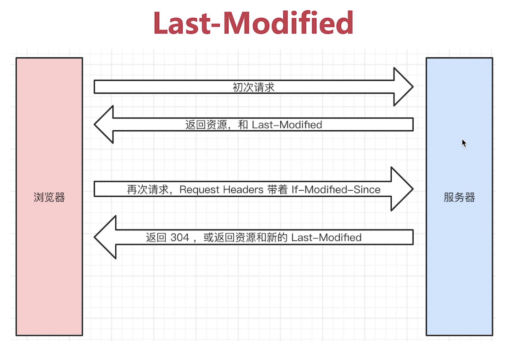
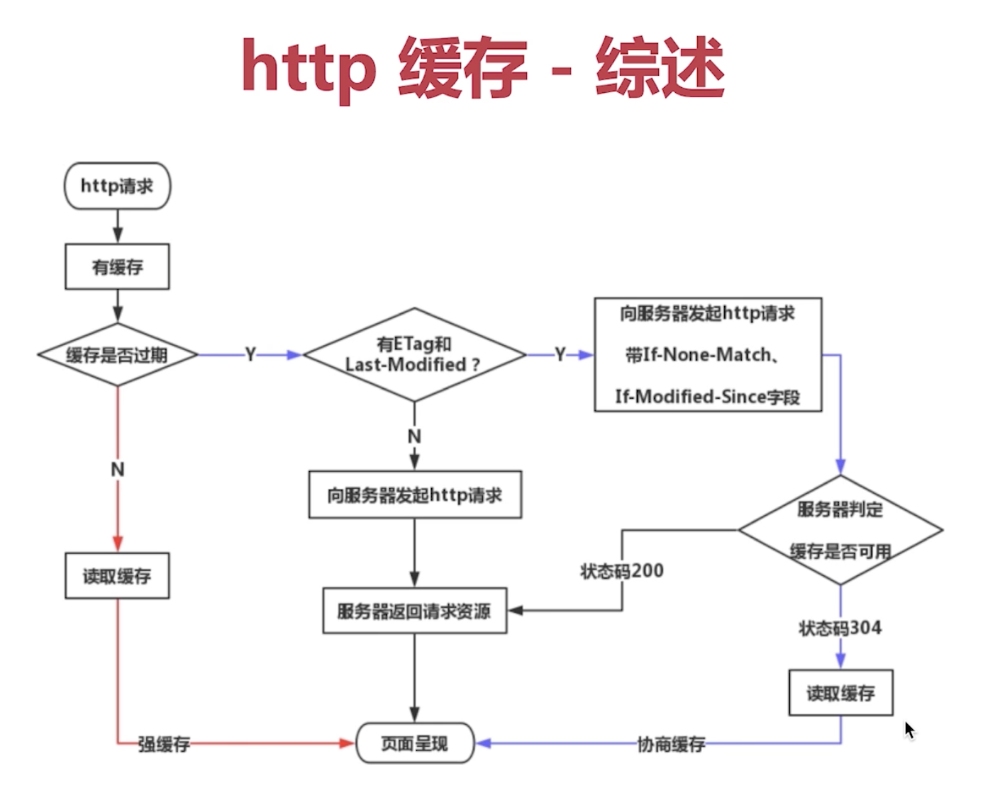

# http 缓存

缓存是什么?

通过复用以前获取的资源，可以显著提高网站和应用程序的性能。Web 缓存减少了等待时间和网络流量，因此减少了显示资源表示形式所需的时间。通过使用 HTTP缓存，变得更加响应性。

哪些资源可以缓存？

CSS, JS, 图片，音频，视频这些不常修改的资源可以用来做缓存。html 一般不能用来缓存，因为 html 会常修改，每次都不一样。

## 1. 强缓存

expires 绝对时间，下发的是服务器时间，而比较的是浏览器时间，浏览器时间和服务器时间可能不一样，有一个缺点。

Cache-Control 缓存控制，他的取值有 max-age, no-cache, no-store, private, public。

- max-age 设置缓存的时间，单位 s。
- no-cache 表示缓存由服务端控制。把请求提交给原始服务器进行验证
- no-store 不使用任何缓存。
- public 表明响应可以被任何对象（包括：发送请求的客户端，代理服务器，等等）缓存.
- private 表明响应只能被单个用户缓存，不能作为共享缓存

如果服务器下发了 expires 和 max-age ，应该以 max-age 为准，这是规定。

## 2. 协商缓存（对比缓存）

- 协商缓存是一种服务端缓存策略。
- 服务端判断资源是不是之前一样，一样则返回 304 状态码，使用之前的本地缓存资源，否则返回 200 状态码和新的资源。

## 3. 资源标识

在 response header 中，有两种，Last-Modified ，和 Etag.

- Last-Modified 资源的最后修改时间，If-Modified-since
- Etag 资源的唯一标识（一个字符串，类似于人的指纹）。If-None-Match

会优先使用 Etag，Last-Modified 只能精确到秒级（秒对于计算机来说是很长的时间单位，计算机一般以毫秒计算）。如果资源被重复生成，而内容不变，则 Etag 更精确。

## 4. Expires

- 相对文件的最后访问时间(Atime)：此时和max-age的值相等
- 绝对修改时间(MTime)：此时Expires的初始值为文件创建时间；而Max-age的初始值为客户端请求数据的时间
