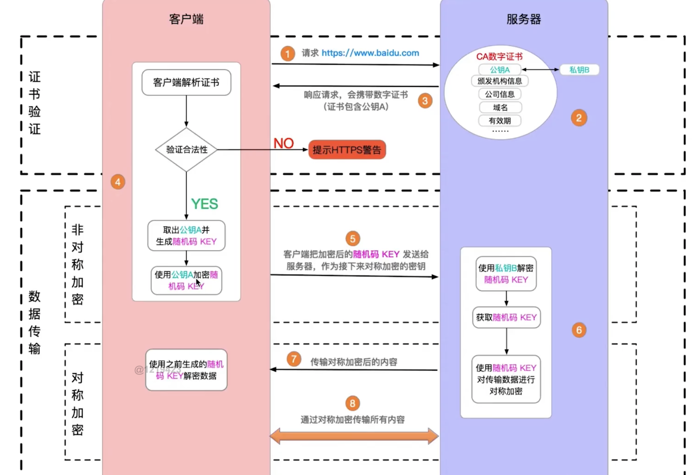

# https

## 1. https 加密

http 是一种传输协议，s 是一种加密。http 传输是明文传输，容易被黑客劫持重要信息。

https 是加密传输。加密方式有对称加密和非对称加密。

- 对称加密是第一次请求后，服务端将信息和 key 发送给客户端，客户端根据这个 key 来加密传输内容，同时服务端通过这个 key 来解密内容。这种对称加密不安全，这种方式如果被黑客劫持了数据和 key，重要数据照样被泄漏。
- 非对称加密，在服务端有私钥和公钥，服务端将公钥和数据传输给客户端，客户端发起请求时同时传递公钥，服务端通过私钥来解密。随后服务端根据私钥生成随机码 key ，通过这个 key 来对称加密传输，减少成本。至始至终服务端都没有传输私钥，一直保留在服务端，黑客即便把数据和公钥都拿到了，都无法解密数据。

非对称加密也可能不安全，因为存在中间人攻击，黑客可以伪造公钥，并使用自己的私钥来解密重要数据。

## 2. https 解密

既然有中间人攻击，那就不能做到安全访问了吗，这时候需要使用 https 证书。

服务端需要先申请合法、正规的 https 证书。

客户端（浏览器厂商）需要和正规的 https 证书签发机构合作，确保能够正确识别有效、安全的 https 证书。

这时候黑客使用自己的公钥来伪装服务端发送的公钥就行不通了，因为证书在浏览器这里没有“备案”。

