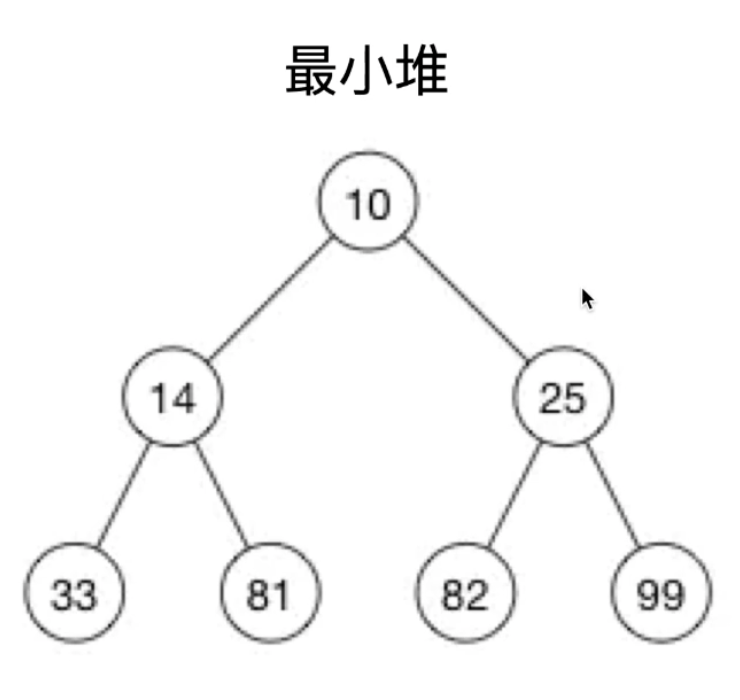

# 二叉树和堆

二叉树是一种特殊的树，它的每一个节点最多包含两个子节点（可能没有子节点，可能是有一个子节点）。

完全二叉树是二叉树的一种特例，每一个节点包含两个子节点。

## 栈和堆

操作系统开辟了内存供栈和堆使用，基本类型（值类型）变量存储在栈内存中，引用类型存储在堆内存中（同时在栈内存中储存了引用地址）。

堆分为最小堆，最大堆。最小堆是父节点小于等于子节点，最大堆是父节点大于等于子节点。

上面的最小堆，每一级父节点都小于等于它的子节点。

二叉搜索树（BST，Binary Search Tree）是指父节点大于左子节点，小于右子节点。

- **堆就是完全二叉树。**
- **堆，逻辑结构是完全二叉树。物理结构是数组。**
- **堆结合了数组和链表的优点（数组查询快，增删改慢，链表是增删改快，查询慢），增删改查时间复杂度都是 O(logn)。**