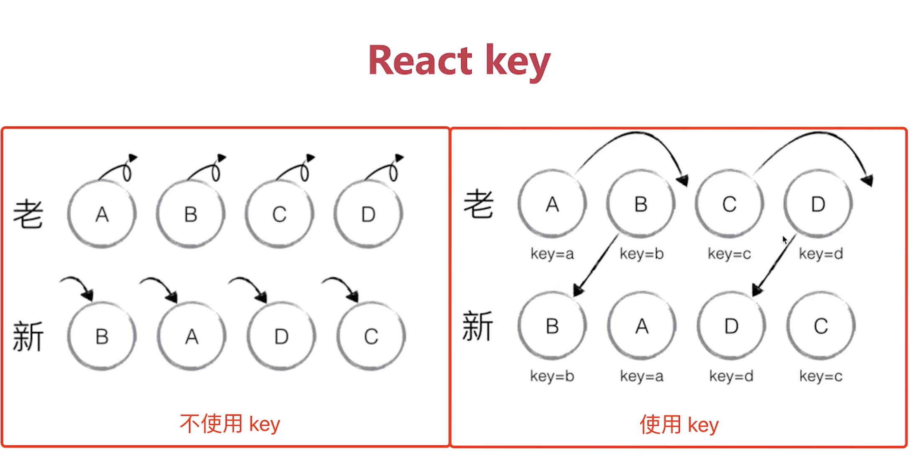

# Vue2 Vue3 和 React diff 算法的区别

diff 应用很广发，比如 GitHub 中的 pull request 中的 diff。

严格的 diff 算法，时间复杂度是 O(n^3)，这个无法使用，需要优化。

- Vue2 是双端比较
- vue3 是最长递增子序列
- React 仅右移

diff 算法真正的复杂度是 O(n^3)，从算法时间复杂度看，该算法不可用。必须优化，Vue2, Vue3, React 优化该算法后，时间复杂度变为 O(n)。

## Tree diff 的优化

- 只比较同一层级，不跨级比较。
- tag 不同，则删除重建，不再比较里面的细节。
- 子节点通过 key 区分。

key 的重要性是用来子节点是否改变，如果改变了则需要删除和重建。

## Vue 和 React 循环时必须使用 key？

- VDOM diff 算法会根据 key 判断元素是否需要删除。
- 匹配到了 key ，元素只是移动，性能好。
- 未匹配到 key, 元素则需要删除重建，影响性能。



上面例图中，如果不使用 key，则删除再重建，如果使用 key，判断到包含这个 key，所以只是移动位置，并不需要删除再重建。

Vue 和 React 中 key 的使用：

```javascript
<ul>
    <li v-for="(item, index) in list" :key="index">
        {{item}}
    </li>
</ul>
```

```jsx
const Item = list.map(item => (
    <li key={item.id}>
        {item.text}
    </li>
));
```