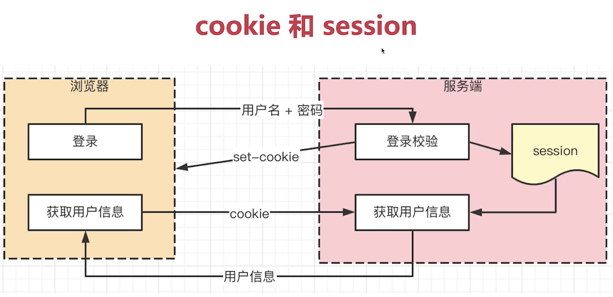

# http 请求中 token 和 cookie 有什么区别

## cookie

- http 无状态，每次请求都要带上 cookie，以帮助识别用户身份。
- 服务端也可以向客户端 set-cookie, cookie 大小限制 4KB。数量限制每个浏览器实现不一样，chrome 是 50 个。
- 默认有跨域限制，不可设置跨域共享 cookie，不可设置跨域传递 cookie 。
- HTML5 之前也可以通过 cookie 进行本地存储，一些很短小的数据。HTML5 之后推荐使用 localStorage 和 sessionStorage 了。

现代浏览器禁止第三方 cookie，为了保护用户隐私。

比如一个场景，A 页面嵌入了京东广告，京东广告是 JS 代码，这些代码可以设置 cookie ，搜集到了用户浏览信息，当这个用户再去访问京东的网站时，京东通过收集到的用户访问信息，就会精准营销，投送广告和猜测用户行为，用户隐私得不到保证。

现代浏览器禁止的就是第三方设置 cookie。

## session

- cookie 用户登录，存储用户标识，如 userId。session 在服务端存储用户详细信息，和 cookie 一一对应。
- cookie 和 session 是常见登录解决方案。

## cookie 和 session 的关系

1. 用户登录操作传输用户名和密码到服务端，服务端查询数据库验证账号是否正确，正确就存入当前会话 session，这里一般不通过硬盘存，而是通过 radius 存，更快。存入的信息一般包括户角色、登录时间等。
2. 服务端 set-cookie 将 userId 返回给客户端，客户端下一次请求其他接口时，会带上 cookie，这个 cookie 包含 userId，浏览器通过这个 userId 去 session 里查找，查找到了证明之前登录过（还没有退出），就做一些操作返回客户端需要的数据。如果是其他用户，又按照上面步骤存储到 session 中。

如过上面步骤不用 session 可以吗？

不太好。

1. 不要 session，就需要把全部详细信息返回给客户端。这很不安全，很多隐私信息万一被劫持，就泄露了用户信息。
2. 体积变大，现在用户信息越来越大，越来越详细，体积变大就造成传输变慢。

## token 和 cookie 区别

- cookie 是 http 规范，token 是自定义传递的。
- cookie 没有被浏览器存储，下一次请求时便会带上，而 token 需要自己存储。
- token 默认没有跨域限制。

## JWT

JWT(json web token) 是一种 token 的解决方案。

1. 用户登录传递用户名和密码，服务端查找数据库如果用户名密码正确则返回一个加密的用户信息字符串。
2. 前端自行在本地存储服务端返回的加密用户信息 token 。
3. 后面的接口请求都带上这个 token。

## JWT 和 session 哪个更好

他们适合的场景不一样。

- 对于那种需要严格管理用户信息的需求（快速封禁，保密）的通过 cookie-session 方式存储。
- 没有特殊要求使用 JWT 很好。

### JWT 优点：

- 不占用服务器内存
- 多进程，多服务器不受影响
- 没有跨域限制

### JWT 缺点

- 用户信息存在客户端，如果用户违规了，没法快速封禁用户（也可以通过加入黑名单方式封禁，不过成本较高）。
- 万一服务端密钥泄漏，用户信息就泄漏了。
- 体积大于 cookie ，所以请求返回会慢一些。

### session 优点

- 用户信息存在服务端，可以快速封禁用户。
- 用户信息不容易泄漏，因为传输时只传了用户ID，没有敏感信息。
- 体积小，请求返回会快一些。

### session 缺点

- 存储在服务器，硬件成本高，而且他不能简单的存在硬盘中，因为不够快。存在内存中，内存比较贵。
- 有跨域限制，多进程、多服务不好同步。