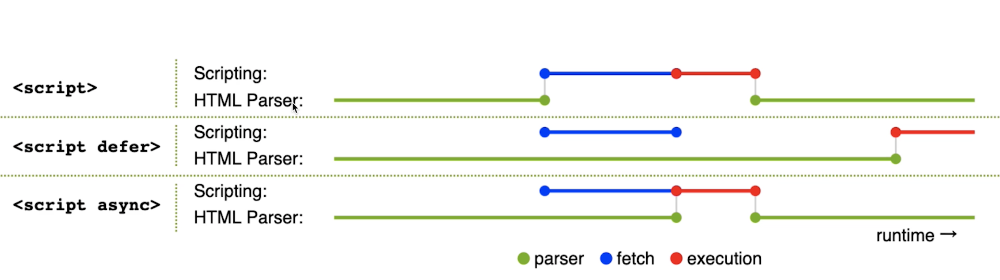
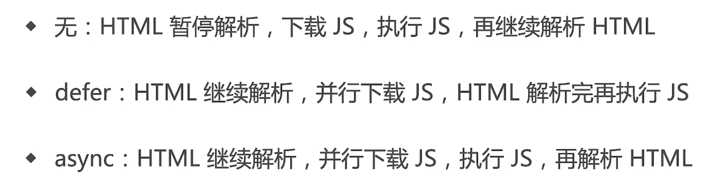

# script 标签 defer 和 async 属性有什么区别



## defer

`defer` 属性的运行流程如下。

1. 浏览器开始解析 `HTML` 网页。
2. 解析过程中，发现带有 `defer` 属性的 `<script>` 元素。
3. 浏览器继续往下解析 `HTML` 网页，同时并行下载 `<script>` 元素加载的外部脚本。
4. 浏览器完成解析 `HTML` 网页，此时再回过头执行已经下载完成的脚本

## async

`async` 属性的作用是，使用另一个进程下载脚本，下载时不会阻塞渲染。

1. 浏览器开始解析 `HTML` 网页。
2. 解析过程中，发现带有 `async` 属性的 `script` 标签。
3. 浏览器继续往下解析 `HTML` 网页，同时并行下载 `<script>` 标签中的外部脚本。
4. 脚本下载完成，浏览器暂停解析 `HTML` 网页，开始执行下载的脚本。
5. 脚本执行完毕，浏览器恢复解析 `HTML` 网页。



## 连环问：prefetch 和 dns-prefetch 有什么区别？

- prefetch 是资源预获取（和 preload 相关）
- dns-prefetch 是 dns 预查询（和 preconnect 相关，preconnect 是预连接）

preload 资源在当前页面使用，会优先加载。prefetch 资源在未来页面使用，空闲时加载。

```html
<head>
    <!-- preload 当前页面要使用，下面用到了 style.css，main.js -->
    <link rel="preload" href="style.css" as="style" />
    <link rel="preload" href="main.js" as="script" />

    <!-- prefetch -->
    <link rel="prefetch" href="other.js", as="script">

    <!-- 引用 CSS -->
    <link rel="stylesheet" href="style.css" />
</head>
<body>
    <!-- 引用 JS -->
    <script src="main.js" defer>
</body>
```

在网络请求前，需要 DNS 解析，再建立 TCP 连接。DNS 解析需要时间，所以可以通过 dns-prefetch 来预解析，通过 preconnect 来预连接。都是针对未来页面的。

```html
<head>
    <link rel="dns-prefetch" href="https://fonts.gstatic.com" />
    <link rel="preconnect" href="https://fonts.gstatic.com" crossorigin />
</head>
```

上面代码，将未来可能要加载的页面，进行提前预解析和预连接，当访问到那个页面时，就会更快。