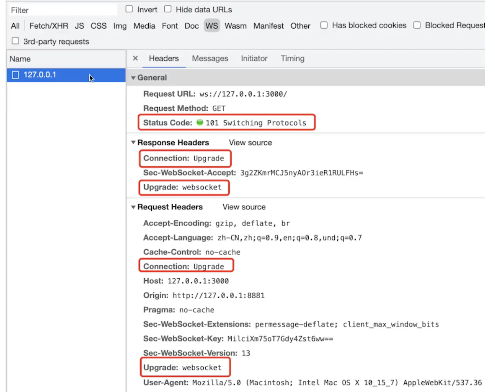

# ws 协议和 http 协议区别

- Websocket 协议以 ws:// 开头，可以双端发起请求。
- 没有跨域限制。
- 通过 send 和 onmessage 通讯。（http 通过 request 和 response 通讯）。

## websocket 连接过程

- 先发起一个 http 请求
- 成功之后，再升级到 websocket 协议，再通讯。

ws 协议也可以升级为 wss 协议，在生产环境使用。

## 连环问：http 长轮训和 websocket 的区别

- http 长轮训，客户端发出请求，客户端阻塞，不会立即返回。
- websocket，客户端发请求，服务端也可以发请求。有了消息后，服务端直接向客户端推送，就不会出现等待的情况。