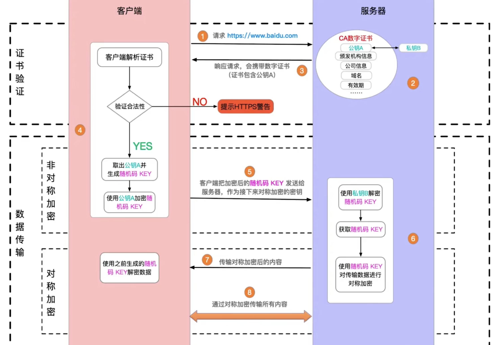
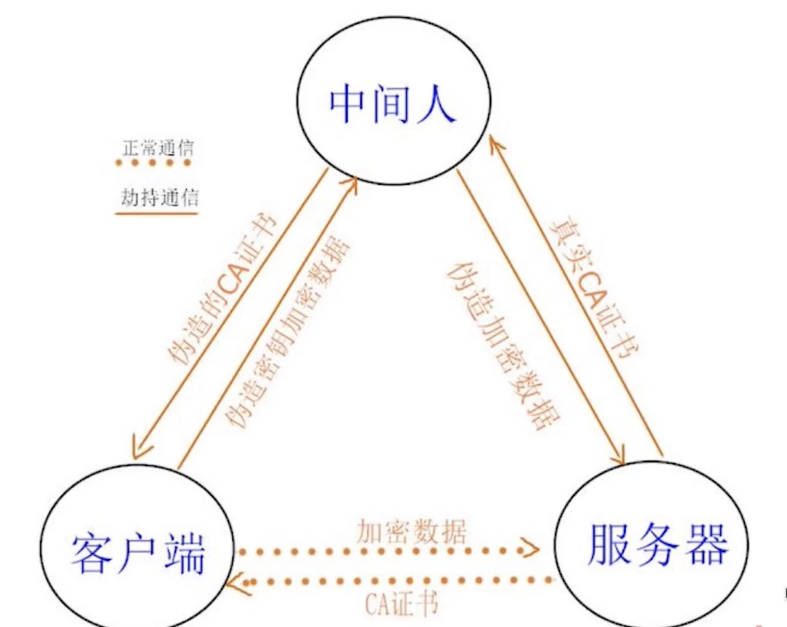

# 什么是 HTTPS 中间人攻击，如何预防？

## https 是如何加密的？

1. 在服务端有公钥和私钥，服务端将公钥传给客户端，客户端根据公钥生成随机码 key。
2. 客户端把随机码传给服务端，作为接下来对称加密的密钥。
3. 服务端使用私钥解密随机码 key，使用随机码 key 对数据进行加密传输。

## 什么是中间人攻击

黑客伪造证书。

## 如何预防

使用正规厂商的证书，慎用免费的。