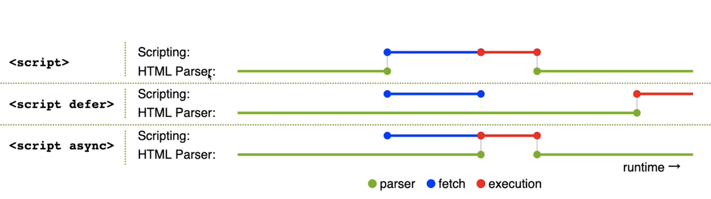
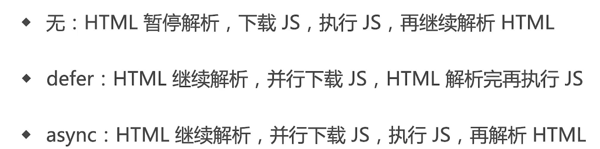

# script 标签 defer 和 async 属性有什么区别

## defer

`defer` 属性的运行流程如下。

1. 浏览器开始解析 `HTML` 网页。
2. 解析过程中，发现带有 `defer` 属性的 `<script>` 元素。
3. 浏览器继续往下解析 `HTML` 网页，同时并行下载 `<script>` 元素加载的外部脚本。
4. 浏览器完成解析 `HTML` 网页，此时再回过头执行已经下载完成的脚本

## async

`async` 属性的作用是，使用另一个进程下载脚本，下载时不会阻塞渲染。

1. 浏览器开始解析 `HTML` 网页。
2. 解析过程中，发现带有 `async` 属性的 `script` 标签。
3. 浏览器继续往下解析 `HTML` 网页，同时并行下载 `<script>` 标签中的外部脚本。
4. 脚本下载完成，浏览器暂停解析 `HTML` 网页，开始执行下载的脚本。
5. 脚本执行完毕，浏览器恢复解析 `HTML` 网页。

## 连环问：prefetch 和 dns-prefetch 有什么区别？

- prefetch 是资源预获取（和 preload 相关）
- dns-prefetch 是 dns 预查询（和 preconnect 相关）
