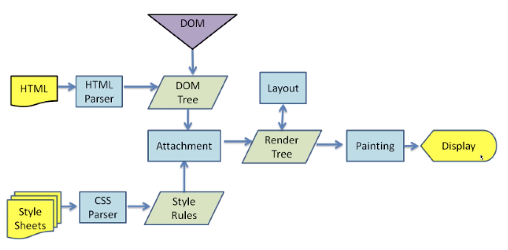

# 从输入 url 到网页显示的完整流程

- http 请求阶段。
- 文档解析阶段。
- 页面渲染阶段。

http 请求阶段：

1. 先进行 DNS 解析，查询到 IP，建立 TCP 连接
2. 进行网络请求。获取 HTML 源码，和静态资源。

文档解析阶段：

1. THML 生成 DOM 树，CSS 生成 CSSOM 树。
2. DOM 和 CSSOM 结合变成 render tree。

页面渲染阶段：

1. 计算，绘制，同时执行 JS。

计算时，会有字符串到结构化数据这一阶段，就是把字符串转换成结构化数据（如数组、对象）。

## 连环问：重绘 repaint 和重排 reflow 有什么区别？

- 重绘是重新绘制。元素的外观改变，如颜色和背景颜色。但是元素的定位和尺寸不变，不影响其他元素。
- 重排是重新排列。要重新计算元素的尺寸和位置，会影响其他元素。
- 重排比重绘影响更大，消耗也更大。需要减少无意义的重排，让重排更少。

减少重排的方法：

1. 集中修改样式，直接切换 CSS class。
2. 修改之前先设置 display，使其先脱离文档流。
3. 使用 BFC 特性，不影响其他元素。
4. 频繁触发 resize 或 scroll ，使用节流和防抖。
5. 使用 createDocumentFragment 批量操作 DOM。
6. 优化动画，使用 CSS3 的 animation。

### BFC

Block format context 块级格式化上下文。

特点就是内部元素如何改动，都不会影响外部元素。

触发条件：

1. 根节点 <html>
2. float: left / right
3. overflow: auto / scroll / hidden
4. dispaly: inline-block / table / table-cell / table-row
5. display: flex / grid 直接子元素
6. position: absolute / fixed