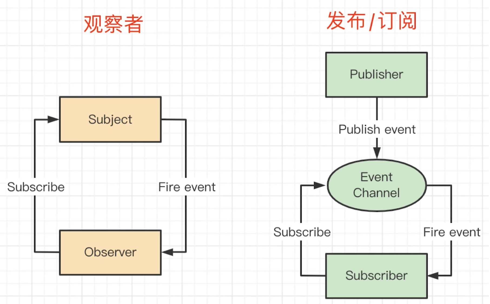

# 前端常用的设计模式和使用场景

1. 工厂模式

2. 单例模式

3. 代理模式

proxy 语法就是使用的代理模式

4. 观察者模式

```javascript
// 一个主题，一个观察者，主题变化之后触发观察者执行
btn.addEventListener("click", () => {...});
```

5. 发布订阅模式

```javascript
function fn1() {}
// 绑定事件
event.on("event-key", fn1)
// 触发执行
event.emit("event-key", fn1)
```

绑定的事件记得解除，防止内存泄漏。

```javascript
event.on("event-key", fn1);
event.off("event-key", fn1);
```

6. 装饰器模式

ES6 或 TS 的 decorator 就是装饰器模式。next.js (node.js 的框架)也大量用到了装饰器。

原功能不变，添加一些新功能。

## 连环问：观察者模式和发布订阅模式的区别

观察者模式：

```javascript
// 一个主题，一个观察者，主题变化之后触发观察者执行
btn.addEventListener("click", () => {...});
```

- 一个主题发射事件到可观察对象。
- 再由可观察对象观察这个主题。

发布订阅模式：

```javascript
function fn1() {}
// 绑定事件
event.on("event-key", fn1)
// 触发执行
event.emit("event-key", fn1)
```

- 有一个 publisher 发布事件到事件管道。
- 由事件管道发射事件到观察者。
- 再由观察者观察事件管道。



**总结**

- subject 和 observer 直接绑定，没有中间媒介。如 addEventListener 绑定事件。
- publisher 和 observer 之间互不认识，需要中间媒介 EventChannel。如 EventBus 自定义事件。