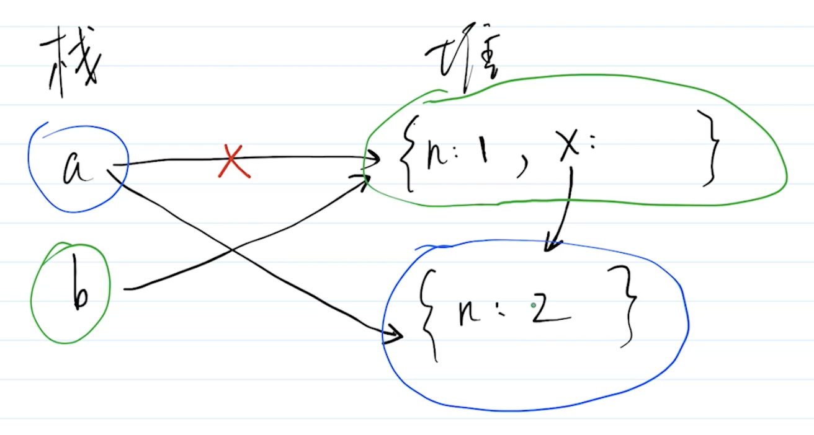
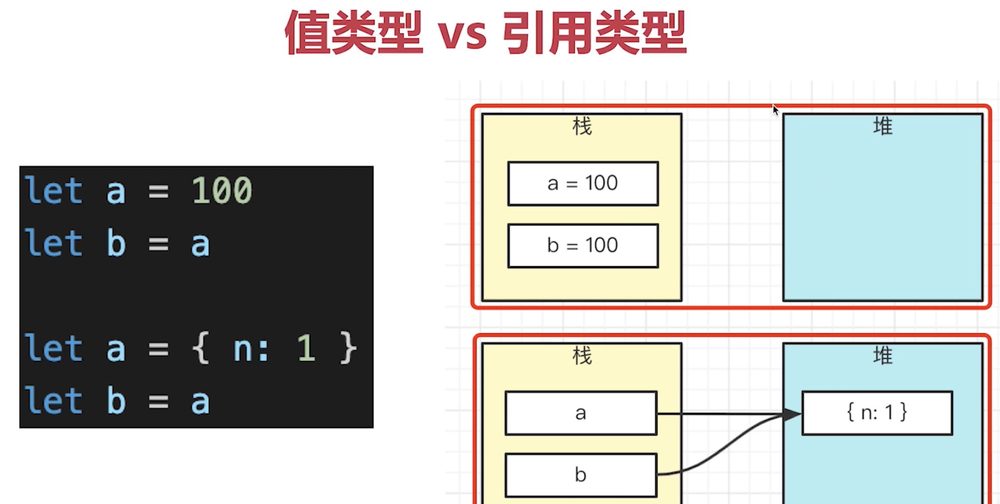

# 对象和属性的连续赋值

```javascript
let a = {n: 1};
let b = a;
a.x = a = {n: 2};
console.log(a.x);  // undefined
console.log(b.x);  // {n: 2}
```

**属性取值 `.` 运算符的优先级比赋值运算优先级高。**

**连续赋值是先执行后面的赋值，再执行前面的赋值。**

上面代码等同于：

```javascript
let a = {n: 1};
let b = a; // b -> {n: 1}
a.x = a = {n: 2};
// 1. a.x = undefined, 2. a -> {n: 2}, 3. b.x -> {n: 2}, 4. b -> {n: 1, x: {n: 2}}
```



**注意：**

值类型和引用类型，存储的位置不同。

值类型在栈中开辟一段内存，存储这个值。引用类型在堆中开辟一段内存存储一个对象，然后变量指向这个对象。


