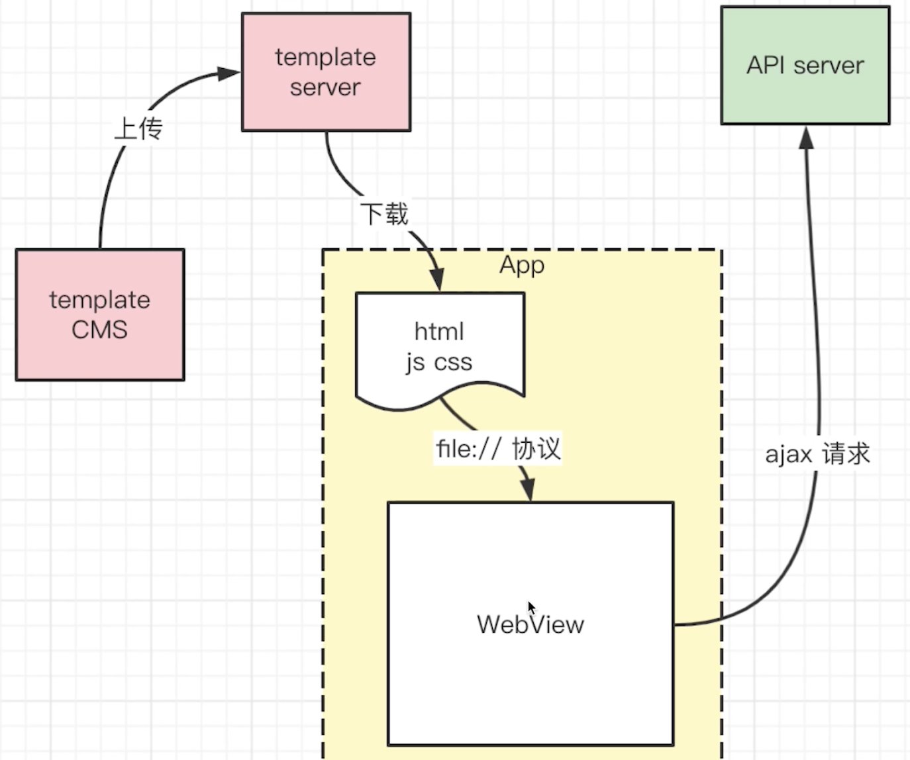
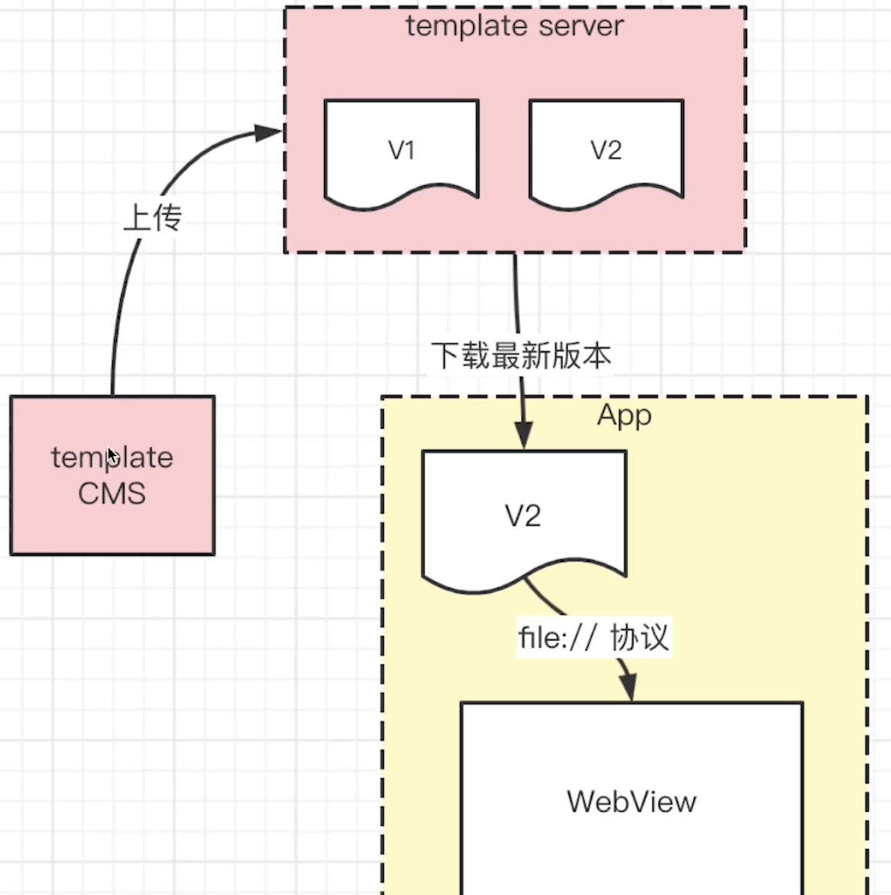

# 描述 hybrid 模版的更新流程

改了一些静态资源，如 html、css、js ，上传到模版服务器，然后 app 下载这些资源，使用 file:// 协议嵌入到 WebView 中，通过 WebView 向 API server 发起 AJAX 请求。从而渲染页面。

模版服务器下载静态资源，不需要 app 更新重新安装，只需要在用户同意情况下静默的修改即可。

**通过 WebView 向 API server 发起 AJAX 请求时，不能省略协议名称，必须要显示申明，不然时以 file:// 协议开头，但是 file:// 从 API server 中获取不到数据。**

template CMS 上传了很多版本，在 template Server 中就有很多版本可用。

## APP 何时下载版本

- APP 启动时检查，如果有新的版本就下载。
- 定时检查（比如 5min 一次），如果有新的版本就下载。

因为有些 APP 是长时间长驻内存，没有被清除掉，所以没有冷启动，所以还需要定时检查。定时检查时间不能太长，如果是添加的新功能没关系，如果是修改 bug （hotfix），就需要立马更新。

## 延迟使用

如果打开了一个 APP 发现有一个新的 template，则可以延迟使用，因为下载和更新需要时间，让用户等待太长时间体验不好，

可以后台下载，下载完了提醒用户更新，本次使用旧版本先使用。
