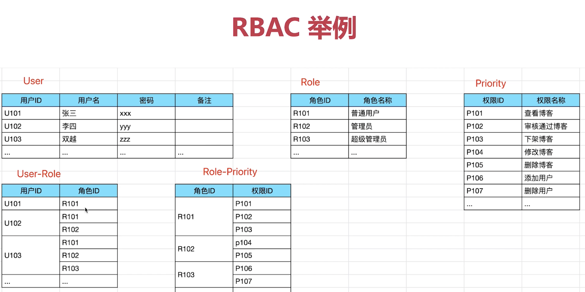

# 用户-权限-角色模型

RBAC (Role-based access control) 基于角色的访问控制。

- 角色 （role_id, role_name）
- 每一个角色下，可以添加很多用户（user_id, user_name），用户归属于某一具体的角色。
- 每一个角色分配不同的权限（access_id, access_name）。
- 这样每个用户就有了自己的权限了。

设计表结构时就是 5 个表，角色表，用户表，权限表，角色与用户的对应关系表，角色与权限对饮关系表。
